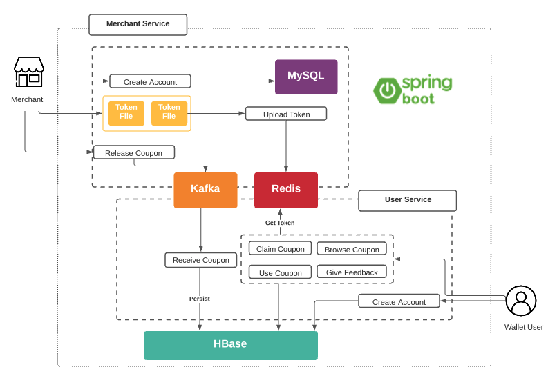

# Wallet Application Backend

## Introduction
This wallet app aims to be act like a digital wallet for user that user can keep card information, see avaialble coupons from various participating merchants, and claim coupons.  

This repo consists two backend services for the wallet app:

* **Merchant Service**: APIs for merchant client to create account, see account information, drop new coupons and upload coupon tokens. 

* **User Wallet Service**: APIs for user client to create account, see avaialble coupons, claim coupons, use coupon, give feedback for app and for a particular coupon. 

## Architecture
 
**kafka**: 2.12, **redis**: 6.2.4, **hbase**: 1.3.5  

## Initialization
* **MySQL**: initialize a database named "wallet" and table called "merchants" 
* **Hbase**: initialize 4 tables, check file for detail (wallet/src/main/resources/wallet.hsh)
* **kafka**: create topic called "merchants-template" and consumer group called "wallet" 

## APIs

### Merchant:
*  create merchant: 
	*  POST: 127.0.0.1:9527/merchants/create
	*  header: key: tokenm value: wallet-merchants
	*  sample data:
		*  ` {
	        "name": "ivydev",
	        "logoUrl": "www.ivyzhao.dev",
	        "businessLicenseUrl": "www.ivyzhao.dev",
	        "phone": "1234567890",
	        "address": "Tampa Florida"
	    }`
* get merchant info:
	* GET: 127.0.0.1:9527/merchants/${merchantId}
	* header: key: tokenm value: wallet-merchants
* merchant drop coupon:
	* POST: 127.0.0.1:9527/merchants/drop
	* header: key: tokenm value: wallet-merchants
	* sample data: 
		* without token: `    {
        "background": 1,
        "desc": "ivyzhao.dev coupon",
        "end": "2021-8-21",
        "hasToken": false,
        "id": 4,
        "limit": 1000,
        "start": "2021-6-21",
        "summary": "coupon summary",
        "title": "coupon-1"
    }`
		* with token: `    {
        "background": 1,
        "desc": "ivyzhao.dev coupon",
        "end": "2021-8-21",
        "hasToken": true,
        "id": 4,
        "limit": 1000,
        "start": "2021-6-21",
        "summary": "coupon summary",
        "title": "coupon-2"
    }` 
* merchant upload token:
	* GET:127.0.0.1:9528/upload
	* merchantsID, PassTemplateId
	* Visit page and upload a token file

### User:
* create user:
	* POST: 127.0.0.1:9528/wallet/createuser
	* sample data: `{
	    "baseInfo": {
	        "name": "user1",
	        "age": 25,
	        "sex": "m"
	    },
	    "otherInfo": {
	        "phone": "1234567890",
	        "address": "San Francisco, CA"
	    }
	}`
* get available coupons:
	* GET: 127.0.0.1:9528/wallet/inventoryinfo?userId=${userId}
* claim coupon:
	*  POST: 127.0.0.1:9528/wallet/gainpasstemplate
	*  sample data for coupon with token: `    {
	        "userId": 109452,
	        "passTemplate": {
	           "id": 4,
	           "title": "coupon-2",
	           "hasToken": true
	        }
	    }`
* get user available coupon info:
	* Get: 127.0.0.1:9528/wallet/userpassinfo?userId=${userId}
* get user used coupon info: 
	* Get: 127.0.0.1:9528/wallet/userusedpassinfo?userId=${userId}
* use coupon:
	* POST: 127.0.0.1:9528/wallet/userusepass
	* sample data: `    {
	        "userId": 109452,
	        "templateId": "bdab4e51df98d1ad745cdc3dfa14d5c1"
	    }`
* create feedback:
	* POST: 127.0.0.1:9528/wallet/createfeedback
		* sample data for app feedback:
		* `    {
		        "userId": 109452,
		        "type": "app",
		        "templateId": -1,
		        "comment": "I love this wallet app!"
		    }`
		* sample data for coupon feedback: 
		* `       "userId": 109452,
		        "type": "pass",
		        "templateId": "bdab4e51df98d1ad745cdc3dfa14d5c1",
		        "comment": "saved money using this coupon!"
		    }`   
* check feedback info:
	* GET: 127.0.0.1:9528/wallet/getfeedback?userId=${userId}

## Demo

